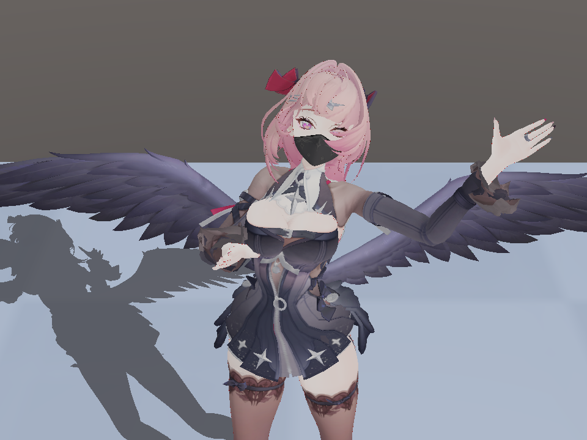
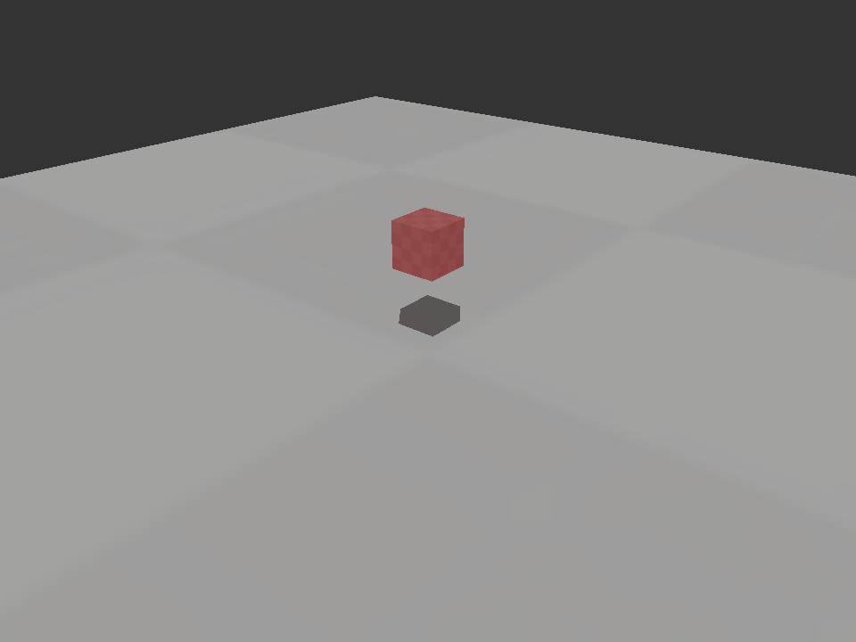

# WISTERIA

[](https://github.com/HoyoVale/WISTERIA/actions/workflows/ci.yml)

WISTERIA 是一个以 OpenGL、Assimp、GLM 和 Bullet 构建的 C++20 实时渲染实验引擎。当前主线是一条完整的 MMD 纵向链路：

```text
PMX 导入 → VMD 动画 → Morph → IK → 刚体物理 → 物理后骨骼 → OpenGL 渲染
```

v1.0.0 的交付形态是可运行的技术演示 + 可复用运行时/渲染核心 + 冻结工程文档。稳定引擎库（SDK）将在后续版本发布，路线见 `docs/architecture/`。

## 核心能力

- **MMD 演示**：PMX 角色 + VMD 动作/相机/灯光，支持 BDEF/SDEF/QDEF CPU 蒙皮。
- **物理**：Saba 自有 Bullet world，默认 120Hz 固定步长、最多 10 子步。
- **渲染**：CSM 阴影、地面阴影投影、程序化天空、OIT、Morph 混合、物理调试线框。
- **确定性**：时间线步进、物理快照恢复、FrameCheckpoint 创建/恢复/回放。
- **Headless**：EGL headless context、离屏渲染与确定性帧序列输出。
- **实验 C ABI**：`wisteria_native` 提供 legacy v0.7 与 stable runtime/render 接口。
- **测试**：12 个 CTest 目标覆盖单元、运行时、集成、渲染、C ABI 与跨进程检查点。

## 演示截图

默认 MMD 演示：



`--ground-lab` 地面阴影测试场景：



## 构建与运行

要求：CMake 3.20+、Visual Studio 2022（Windows），或支持 C++20 的 Linux 工具链。

Windows PowerShell：

```powershell
.\run.ps1 test    # 配置、编译并运行全部测试
.\run.ps1 run     # 配置、编译并启动默认 MMD 演示
.\run.ps1 sdk     # 编译、安装 Stable C ABI SDK 并运行消费测试
.\run.ps1 package # 编译并生成 Stable C ABI SDK zip 包
```

Linux：

```bash
./build_linux.sh
./build-linux/wisteria
```


## CI 与 Release 自动化

- 每次 push / PR：Windows MSVC 与 Linux X11 双矩阵构建，并运行全部 CTest。
- 推送 `v*` 标签：自动构建 Windows zip 与 Linux tar.gz SDK 包，并发布到 GitHub Release。

Workflow 定义：`.github/workflows/ci.yml`、`.github/workflows/release.yml`。
## 演示资产

仓库不分发 `assets/models/` 与 `assets/motions/` 下的 PMX/VMD 文件（版权与体积原因）。默认角色模型、动作和场景模型需自行准备：

```powershell
.\script\setup_demo_assets.ps1 -SourceRoot <包含 models 和 motions 的目录>
```

默认 Demo 需要：

```text
assets/models/mmd/蕾米埃尔-黑/蕾米埃尔-黑.pmx
assets/motions/梦的翅膀/梦的翅膀motion.vmd
assets/motions/梦的翅膀/梦的翅膀camera.vmd  （可选）
```

详细目录、手工放置方法和授权提醒见 `docs/ASSETS.md`。

资产缺失时的行为：

- 默认角色 PMX 缺失：程序给出明确错误，提示运行资产准备脚本。
- 默认 VMD 缺失：打印警告并以无动作状态继续。
- 不依赖任何外部资产：`--ground-lab`。

## 运行选项

```text
--model <pmx>       指定角色 PMX 路径
--motion <vmd>      指定角色 VMD 路径
--scene <pmx>       场景模式，加载舞台 PMX
--gltf <glb|vrm>   通用 glTF/GLB/VRM 查看模式
--ground-lab        固定相机地面 + 立方体阴影测试场景（无需外部资产）
--alternate-model   使用备用内置模型 preset
--frames <n>        精确运行 n 帧后退出（配合 --fixed-dt）
--fixed-dt <sec>    指定 --frames 的固定帧间隔，例如 0.0166667
--render-smoke      等价于 --frames 180 --fixed-dt 0.0166667
--help              查看帮助
```

示例：

```powershell
.\run.ps1 run -ApplicationArguments '--scene'
.\run.ps1 run -ApplicationArguments '--gltf tests/assets/models/Box.glb'
.\run.ps1 run -ApplicationArguments '--alternate-model'
.\run.ps1 run -ApplicationArguments '--ground-lab'
.\run.ps1 run -ApplicationArguments '--frames 180 --fixed-dt 0.0166667'
```

## 窗口控制

```text
Space       暂停 / 继续动作
C           开关 VMD 相机轨
← / →       降低 / 提高相机移动速度
W A S D     移动相机
Q / E       下降 / 上升
Shift       加速移动
鼠标右键     捕获 / 释放鼠标视角
滚轮         调整 FOV
R           重置相机
Esc         释放鼠标
```

## 工程结构

源码按领域模块组织：

| 模块 | 职责 |
| --- | --- |
| `core` | Transform、Timer、Root Motion |
| `animation` | Skeleton、Pose、Animator、Morph |
| `physics` | 格式无关 Bullet 后端 |
| `mmd` | PMX/VMD 格式语义与转换 |
| `assets` | PMX/模型导入与资源管理 |
| `rendering` | OpenGL 资源与渲染 |
| `scene` | Entity、Scene、Behaviour 编排 |
| `platform` | 窗口、输入、Application |
| `runtime` | 模型运行时驱动抽象与确定性能力 |
| `native` | 实验性 C ABI |

依赖规则与 include 规范见 `docs/architecture/PROJECT_LAYOUT.md`。

## 当前架构状态

- 活动 MMD 后端：`ModelBackendRegistry → SabaMmdBackend → SabaMmdRuntimeModel`。
- `MmdPhysicsInstance + 共享 PhysicsWorld + MmdPhysicsRuntimePolicy` 为 Legacy WISTERIA-owned physics path，不参与 Saba 主运行链。
- MMD 兼容契约：R1.3 Phase 0A 已冻结，默认档 `MMD_RAW`。
- 渲染架构：R2.0 后端中立化已收口；Vulkan 后端仅为契约草案，未实现。

## 文档

```text
docs/README.md                      文档总索引
docs/ASSETS.md                      演示资产说明
docs/SDK.md                         Stable C ABI SDK 使用文档
docs/architecture/                  架构契约、设计、审计
docs/validation/                    各阶段验证基线与收口报告
RELEASE_NOTES.md                    v1.0.0 发布说明
LEARN.md                            早期开发学习记录
```

## 许可证

WISTERIA 自身代码以 MIT License 发布，见 `LICENSE`。第三方库保留各自许可证；演示 PMX/VMD 资产不入库，使用者需自行遵守其原始授权条款。
